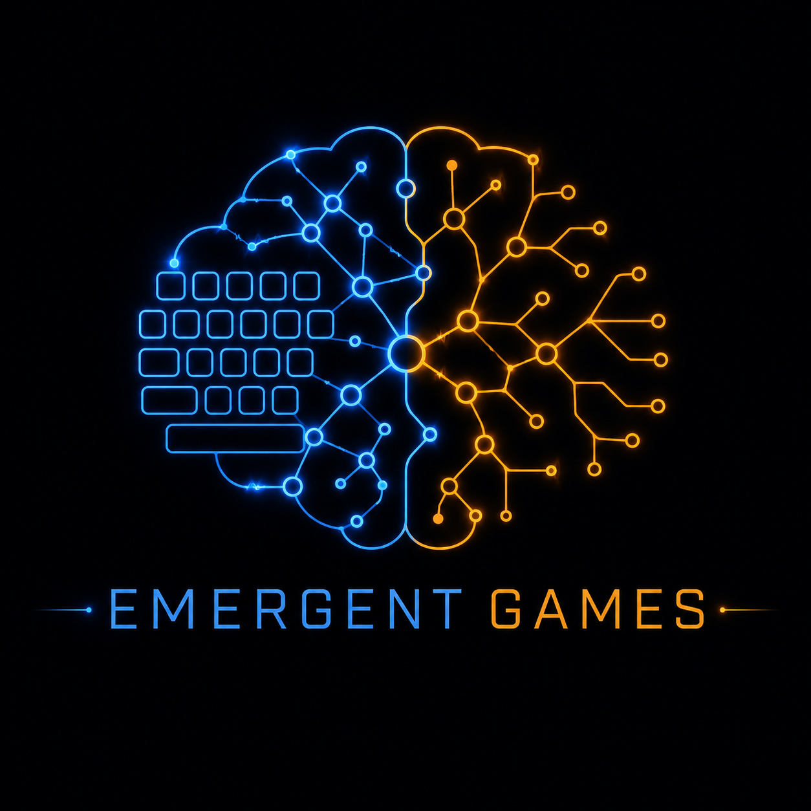

# 🎮 AI Emergent Games - a.k.a One-Prompt-Games!

**One-prompt games that run entirely inside your favorite chatbot.**

No apps. No installs. No accounts. Just copy a prompt, paste it into ChatGPT, Claude, Gemini, or any capable LLM — and play.

Should you remember MUD games, in the nineties? This feels the same! But no game, no character, no scene you're in these games will ever be the same, like back then!

---

## What are Emergent Games?

Each game is a single prompt that transforms an AI chatbot into a fully interactive game engine. The AI simulates:

- **Autonomous agents** — NPCs, factions, characters with hidden goals and strategies
- **System meters** — Quantified world state that changes based on your decisions
- **Causal feedback loops** — Actions have direct, indirect, and delayed consequences
- **Emergent storytelling** — No scripted narrative. Everything arises from the system state

**The core principle:** You don't control the world. You make decisions *within* the world. Everything else reacts.

---

## Game Collections

### 🇳🇱 `emergent-games-nl/` — Dutch Collection (21 games)

The original set. Complex system simulations covering politics, medicine, philosophy, journalism, and more.

| Highlights | |
|---|---|
| Kabinet van Glas | Political coalition management |
| Socrates.exe | Philosophy through stress testing |
| Cold Case: 1987 | Detective with fixed hidden truth |
| Meaning | Philosophical windtunnel for your worldview |

---

### 🇬🇧 `emergent-games-en/` — English Collection (20 games)

Diverse themes: crime, space, psychology, history, art, survival, horror, philosophy.

| Highlights | |
|---|---|
| The Heist | Plan a museum heist with unreliable crew |
| Pirate Republic | Nassau 1715 — govern the ungovernable |
| The Cult Deprogrammer | Extract someone from a controlling group |
| The Last Library | Preserve knowledge after civilizational collapse |

---

### 📰 `emergent-games-news-20260817/` — News Edition (20 games)

Inspired by headlines from August 17, 2026. Geopolitics, technology, climate, military, civil rights.

| Highlights | |
|---|---|
| Strait of Fire | US-Iran crisis management |
| The Carrier | Military morale collapse on deployed ship |
| Data Center Nation | $7B AI deal vs. local water resources |
| The Blackout Model | AI predicts disaster — traditional models disagree |

---

### 🐉 `emergent-games-dnd/` — Dungeons & Dragons Edition (20 games)

D&D-inspired fantasy worlds using the emergent agent engine. No dice, no character sheets — just decisions and consequences in magical settings.

| Highlights | |
|---|---|
| Lich's Gambit | You're a lich seeking redemption |
| Thieves' Parliament | Criminal democracy — anyone can challenge you |
| The Migration | Orc nation seeking peaceful passage |
| Golem Rights | Fantasy civil rights — constructs want freedom |

---

### 💕 `emergent-games-korean/` — Korean Love Story Edition (20 games)

K-drama inspired romance with emotional intensity, push-pull dynamics, and beautiful suffering. OST moments included.

| Highlights | |
|---|---|
| Second Lead Syndrome | You're the one who won't be chosen |
| Contract Marriage | Fake becomes real |
| Time-Slip Love | You loop — they don't |
| Revenge Romance | You planned to destroy them, then fell in love |

---

### 🏢 `emergent-games-par/` — PAR Edition (20 games)

**Proving Alleged Resilience** — Chaos Monkey for organizations. Deliberately disrupt departments, tools, or communication channels and see what survives.

Different company types and sizes (30 to 10,000 people).

| Highlights | |
|---|---|
| The Missing Middle | Remove all middle management for a week |
| Dark Mode | Hospital goes back to paper |
| The Transparency Bomb | All internal comms visible to everyone |
| The Intern Takeover | Interns run everything, seniors observe |

---

### 🔪 `emergent-games-murder/` — Murder Mystery Edition (20 games)

Agatha Christie-style whodunits. A murder has been committed. You must find the killer before they find you. The AI generates a fixed hidden truth at the start — the solution exists from Turn 1.

**Win:** Correctly accuse the murderer with evidence.  
**Lose:** Accuse the wrong person, or become the next victim.

| Highlights | |
|---|---|
| Death at the Manor | Classic English country house poisoning |
| The Locked Laboratory | Impossible locked-room mystery |
| Murder on the Express | Night train, locked compartment, you're the conductor |
| Death in First Class | 7 hours on a plane with the killer |

---

### 🧠 `emergent-games-mw/` — Mentale Weerbaarheid (20 games)

Dutch-language games for young adults (14-18) about mental resilience. Based on the [Mentale Weerbaarheid](https://mentaleweerbaarheid.eu) educational program. Not a lesson — an experience.

**Jaar 1 — Het individu:** emoties, energie, grenzen, zelfkennis
**Jaar 2 — De groep:** peerdruk, conflict, empathie, onderhandelen  
**Jaar 3 — De maatschappij:** manipulatie, kritisch denken, polarisatie

| Highlights | |
|---|---|
| Munten | Verdeel je energiemunten over een schoolweek |
| De Groepschat | Getuige van pesten in WhatsApp |
| Bubbel | Hoe het algoritme je radicaliseert |
| Wie Ben Ik? | Identiteit zoeken onder sociale druk |

---

## How to Play

1. Open any game file
2. Copy everything inside the code block (` ``` `)
3. Paste into your chatbot of choice
4. Play

Works best with: **Claude**, **ChatGPT (GPT-4+)**, **Gemini Pro**

---

## Game Engine Design

All games share the same engine architecture:

```
World State
    ↓
Autonomous Agents (hidden goals, strategies, memory)
    ↓
Event / Dilemma
    ↓
Player Decision
    ↓
Agent Reactions
    ↓
System Effects (direct → indirect → delayed)
    ↓
New World State
```

Key principles:
- **No predetermined narrative** — story emerges from system dynamics
- **Agents are autonomous** — they act on their own interests, not the player's
- **Decisions have consequences** — including delayed ones that surface turns later
- **No correct answers** — values genuinely conflict
- **The player is not protected** — bad choices have real consequences

---

## Contributing

Want to create your own emergent game? Use any existing game as a template. The key elements are:

1. A **setting** with inherent tension
2. **7 meters** that conflict (you can't maximize all simultaneously)
3. **5-8 agents** with hidden, competing goals
4. A **special mechanic** unique to your game
5. A **turn structure** that creates rhythm

---

## License

These games are free to use, share, and modify. Attribution appreciated.

---

## Logos

Each collection has a generated logo (`logo.png`) and its generation prompt (`logo-prompt.md`) in its directory. The main project logos are `logo-v1.png` and `logo-v2.png` in the root.

---

*Created with the Emergent Agent Game Engine — a format for one-prompt AI-driven systemic storytelling.*
