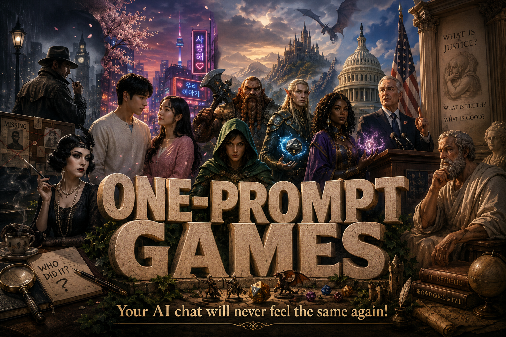

# 🎮 One-Prompt Games — Play in Any Chatbot, Right Now



**Copy one prompt. Paste it into ChatGPT, Claude, or Gemini. You're playing.**

No downloads. No sign-ups. No apps. No rules to memorize. Just you, a chatbot, and a world that reacts to everything you do.

Remember MUD games from the nineties? This is that feeling — but wilder. Every character has their own hidden agenda. Every decision ripples through the system. And no two playthroughs are ever the same. Ever.

🌍 **Play in any language!** Just add this line to any game prompt:

> `I want to play this in my native language: [YOUR LANGUAGE]`

French, Spanish, Japanese, Arabic, Hindi, Portuguese — whatever you speak. The entire game adapts.

> *"I just lost three hours to the Pirate Republic game. I was trying to govern Nassau and my own crew mutinied because I showed mercy to a spy. This is insane."* — early player

---

## 🧨 What Makes These Different?

This isn't "choose your own adventure." There are no pre-written paths. No right answers. No safety net.

The AI runs a **living simulation** with:

- 🎭 **Autonomous agents** — characters with hidden goals who scheme, betray, and adapt *without your permission*
- 📊 **System meters** — the world has numbers, and when they hit extremes, things break structurally
- 🔄 **Causal chains** — what you did in Turn 3 comes back to haunt you in Turn 15
- 🌊 **Emergence** — the story writes itself from system pressure, not from a script

**You don't control the world. You survive within it.**

---

## 🎲 581 Games. 29 Genres. Zero Installs.

Yeah, you read that right. Five hundred and eighty-one unique games across twenty-nine collections. Every single one playable with a single copy-paste. Here they all are:

---

### 🇳🇱 Dutch Collection — *21 games*
`emergent-games-nl/`

The originals. Complex Dutch-language system simulations that started it all. Run a coalition government, manage a hospital on the brink, solve a cold case from 1987, or stress-test your own philosophical worldview until it cracks.

🔥 *Kabinet van Glas • Socrates.exe • Cold Case: 1987 • Meaning*

---

### 🇬🇧 English Collection — *20 games*
`emergent-games-en/`

The flagship international set. From planning a museum heist with an unreliable crew to governing a pirate republic to preserving the last library after civilizational collapse.

🔥 *Pirate Republic • The Cult Deprogrammer • The Last Library • Rogue Nation*

---

### 📰 News Edition (August 2026) — *20 games*
`emergent-games-news-20260817/`

Ripped from today's headlines. The US-Iran ceasefire just expired. A carrier's crew is breaking. An AI weather model disagrees with human ones. Welcome to geopolitics.

🔥 *Strait of Fire • The Carrier • The Blackout Model • The $7 Billion Gateway*

---

### 🐉 Dungeons & Dragons — *20 games*
`emergent-games-dnd/`

All the magic of D&D, none of the dice. You're a lich seeking redemption. A regent holding a kingdom together. An orc chieftain begging for peaceful passage. A guildmaster ruling a democracy of thieves.

🔥 *Lich's Gambit • Thieves' Parliament • The Migration • Golem Rights*

---

### 💕 Korean Love Stories — *20 games*
`emergent-games-korean/`

The emotional devastation of K-drama, fully interactive. Rain scenes. Rooftop confessions. OST moments. The beautiful agony of almost-love. You *will* feel things.

🔥 *Second Lead Syndrome • Contract Marriage • Time-Slip Love • Revenge Romance*

---

### 🏢 PAR: Proving Alleged Resilience — *20 games*
`emergent-games-par/`

Chaos Monkey for entire companies. Rip out middle management. Kill all communication tools. Let interns run everything. See what happens. Learn what your organization actually is versus what the org chart claims.

🔥 *The Missing Middle • Dark Mode • The Transparency Bomb • The Intern Takeover*

---

### 🔪 Murder Mysteries — *20 games*
`emergent-games-murder/`

Agatha Christie in your chat window. A real murderer. Fixed hidden truth. You must find them — before they find you. Get it wrong and you might not get a second chance.

🔥 *Death at the Manor • The Locked Laboratory • Death in First Class • Murder at the Will Reading*

---

### 🧠 Mentale Weerbaarheid — *20 games*
`emergent-games-mw/`

Dutch-language games for teenagers (14-18) about mental resilience. Not preachy. Not school-like. Real situations: peer pressure, energy management, social media traps, identity under pressure. Based on the [Mentale Weerbaarheid](https://mentaleweerbaarheid.eu) curriculum.

🔥 *Munten • De Groepschat • Bubbel • Wie Ben Ik?*

---

### 💻 Hackers — *20 games*
`emergent-games-hackers/`

Jack into the system. Zero-days, social engineering, ransomware response, nation-state ops, ethical dilemmas that have no clean answers. Every keystroke leaves a trace.

🔥 *Zero Day • Ransomware • AI vs Hacker • Digital Ghost*

---

### 🧟 Zombie Apocalypse — *20 games*
`emergent-games-zombie/`

Not just survival horror — survival *politics*. Trust crumbles faster than walls. Twenty scenarios from shopping malls to cruise ships to intelligent zombies who are *organizing*.

🔥 *The Cruise Ship • Research Lab • Intelligent Zombies • Year Two*

---

### 💘 Dating Sim — *20 games*
`emergent-games-dating/`

Modern love in all its awkward, terrifying glory. The typing indicator. The three-day silence. The "what are we" conversation. Funny, painful, real.

🔥 *The Situationship • Love Bombing • The Breakup • Catfish*

---

### 🎯 Heist Crew — *20 games*
`emergent-games-heist/`

Assemble a team. Plan the perfect job. Watch it fall apart in real time. Ocean's Eleven meets Murphy's Law.

🔥 *The Casino • The Double Cross • The Reverse Heist • The Last Job*

---

### 🏝️ Survival Island — *20 games*
`emergent-games-survival/`

Stranded. Limited resources. Strangers who don't trust each other. And someone might not want rescue. Lord of the Flies was optimistic.

🔥 *The Bunker • The Saboteur • The Raft • Lord of the Flies*

---

### 👻 Haunted School — *20 games*
`emergent-games-haunted/`

High school was already terrifying. Now add the supernatural. Stranger Things meets Wednesday meets the horror of adolescent social dynamics.

🔥 *The App • Spirit Week • The Memory • The Metaroom*

---

### ⏰ Time Travel Paradox — *20 games*
`emergent-games-timetravel/`

Every fix breaks something else. Every timeline you save erases another. Your future self is sending warnings — but can you trust them?

🔥 *The Loop • The Butterfly • The Last Day • The Anchor*

---

### ⚽ Sports Dynasty — *20 games*
`emergent-games-sports/`

Build dynasties. Manage egos. Survive the media. From Premier League promotion to F1 team politics to esports burnout.

🔥 *F1 Team Principal • Esports • Relegation Battle • Dynasty in Decline*

---

### 👨‍🍳 Cooking Competition — *20 games*
`emergent-games-cooking/`

The heat is real. Michelin inspectors, Kitchen Nightmares, Iron Chef countdowns. Your reputation lives or dies with every plate.

🔥 *The Michelin Inspector • Iron Chef • Food Poisoning • Family Recipe*

---

### 🎙️ True Crime Podcast — *20 games*
`emergent-games-truecrime/`

You're investigating live. Your audience is listening. Your suspects know you exist. And someone really doesn't want this case reopened.

🔥 *The Wrongful Conviction • The Copycat • Live Episode • The Threat*

---

### 🔑 Escape Room — *20 games*
`emergent-games-escape/`

Locked in. Clock ticking. Group fracturing. Except sometimes it's not a game — and the room doesn't want you to leave.

🔥 *The Kidnapping • The Metaroom • The Memory Room • The Parallel Rooms*

---

### 👑 Royal Court — *20 games*
`emergent-games-royalcourt/`

Bridgerton meets Game of Thrones. Every courtesy hides a blade. Marriage is warfare. Scandal is a weapon. And you have secrets of your own.

🔥 *The Foreign Bride • The Spymaster • The Bastard • The Last Dynasty*

---

### 🤵 Organized Crime — *20 games*
`emergent-games-mafia/`

The Godfather. The Sopranos. Peaky Blinders. Rise, rule, and try to get out alive. Loyalty is currency and betrayal is everywhere.

🔥 *The Widow • The Rat • The Retirement • The Prohibition*

---

### 🚀 Space Trader — *20 games*
`emergent-games-spacetrader/`

Firefly in your chatbot. Haul cargo, dodge factions, keep your crew together, and never open the mysterious crate in hold seven.

🔥 *The Cargo • The Refugees • The Mutiny • The Distress Call*

---

### 👶 Parenting — *20 games*
`emergent-games-parenting/`

The hardest game of all. Raise a child from 0 to 18. Every choice shapes who they become. There is no walkthrough. There is no winning. There is only love and hoping you got it right.

🔥 *The Teenager • The Diagnosis • The Screen Time • The Legacy*

---

### 📱 Influencer Empire — *20 games*
`emergent-games-influencer/`

Build your following. Lose yourself. The algorithm is the real enemy. And one old tweet can end everything.

🔥 *The Cancellation • The Burnout • The Authenticity Trap • The Off Switch*

---

### 🔓 Prison Break — *20 games*
`emergent-games-prisonbreak/`

Shawshank. The Great Escape. Papillon. Plan meticulously. Execute perfectly. And pray that one variable you didn't account for doesn't ruin everything.

🔥 *The Death Row • The Long Game • The Freedom Paradox • The Island*

---

### 🐺 Social Deduction — *20 games*
`emergent-games-werewolf/`

One of you is the traitor. Or maybe it's you. Werewolf, Mafia, Among Us — but with AI running every other player, and they're *smart*.

🔥 *The AI • Reverse Werewolf • The Submarine • The Hospital*

---

### 🎸 Music Band — *20 games*
`emergent-games-band/`

Form the band. Write the songs. Play the gigs. Destroy each other with ego. The music industry chews up dreamers.

🔥 *The Tour • The Addiction • The Viral Moment • The Legacy*

---

### 🛋️ Therapy Session — *20 games*
`emergent-games-therapy/`

The most unexpected genre. You ARE the therapist. Real-seeming clients. Real dilemmas. Sometimes you help. Sometimes you can't. Sometimes they help you understand yourself.

🔥 *The Crisis • The Secret • The Child • The Mirror*

---

### 🤖 AI Governance — *20 games*
`emergent-games-ai-governance/`

The most relevant game of our time. AI is getting smarter every turn — *automatically*. You're the regulator trying to build frameworks faster than the technology evolves. And the AI? It's a player at the table now. It has opinions. It makes moves. Good luck.

🔥 *The Emergence • The Recursion • The Cooperative AI • The Singularity*

---

## ▶️ How to Play

It's absurdly simple:

1. **Pick a game** — browse any collection above
2. **Open the file** — find the code block inside
3. **Copy** everything between the ``` marks
4. **Paste** into ChatGPT, Claude, Gemini, or any capable LLM
5. **Play**

That's it. No setup. No tutorial. The game explains itself.

Works best with: **Claude** • **ChatGPT (GPT-4o / o1)** • **Gemini Pro**

---

## 🔧 How the Engine Works

Every game runs on the same core architecture:

```
World State (7 meters, 0-100)
    ↓
Autonomous Agents (5-8, hidden goals, memory, strategies)
    ↓
Event / Dilemma emerges from system state
    ↓
YOU make a decision (or invent your own)
    ↓
Agents react independently
    ↓
Effects cascade (direct → indirect → delayed)
    ↓
New World State
    ↓
Repeat until something breaks — or you do
```

**No predetermined narrative.** No "correct path." No safety net. The world doesn't care about your feelings. But it will remember your choices.

---

## 🤝 Want to Create Your Own?

Every game is just a markdown file with a prompt. Fork this repo, copy any game as template, and fill in:

1. A **setting** with inherent tension (no tension = no game)
2. **7 meters** that genuinely conflict (you CAN'T max them all)
3. **5-8 agents** with hidden, competing goals
4. A **special mechanic** unique to your game
5. A **turn structure** that creates rhythm and pressure

Pull requests welcome. The more genres, the better.

---

## 📜 License

Free to use, share, remix, and build upon. Attribution appreciated but not required. Go make something.

---

## 🎨 Logos

Each collection has its own generated logo (`logo.png`) and generation prompt (`logo-prompt.md`). The main project logos live in the root as `logo-v1.png` and `logo-v2.png`.

---

<p align="center"><em>581 games. 29 genres. One copy-paste.<br/>Made with the Emergent Agent Game Engine.</em></p>
