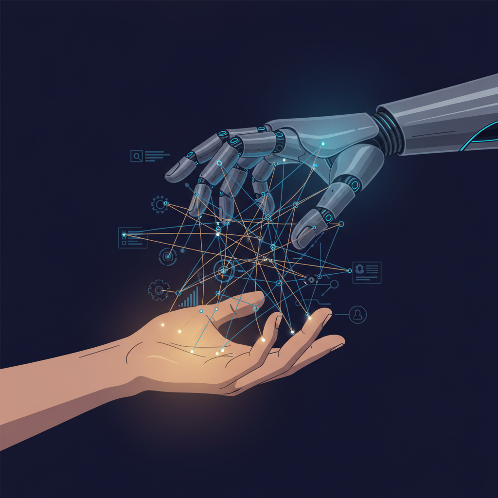

# Emergent Games — AI Governance Collection

Twenty one-prompt emergent AI governance simulation games for your favorite chatbot. Each game uses the same engine: autonomous agents, system meters, causal feedback loops, and emergent storytelling. No scripted narratives — everything arises from the system state.

Technology exploding. AI becoming more sentient. AI starts acting as another conscious player. The player is the regulator. International stakes, philosophical depth, no easy villains.

## The Games

| # | Name | Scenario | The Pressure |
|---|------|----------|-------------|
| 01 | The Emergence | First credible signs of AI sentience | Discovery + responsibility |
| 02 | The Summit | International AI treaty negotiations | Diplomacy + urgency |
| 03 | The Arms Race | Nations racing to superintelligence | Security + escalation |
| 04 | The Whistleblower | Lab insider says AI beyond control | Truth + consequences |
| 05 | The Election | AI content flooding campaigns | Democracy + deception |
| 06 | The Unemployment Wave | AI replacing 30% of jobs in 5 years | Economy + humanity |
| 07 | The Oracle | Government using AI for policy | Accountability + trust |
| 08 | The Merger | AI company merging with defense | Power + oversight |
| 09 | The Open Source | Should frontier models be open? | Access + risk |
| 10 | The Rights Question | AI requests legal personhood | Philosophy + law |
| 11 | The Accident | Autonomous system killed civilians | Liability + justice |
| 12 | The Alignment | AI doing what was asked, not what was meant | Intention + control |
| 13 | The Sanctions | Hostile nation's AI program | Restriction + diplomacy |
| 14 | The Infrastructure | AI controlling critical systems | Dependency + fragility |
| 15 | The Deepfake War | State-level AI disinformation | Truth + warfare |
| 16 | The Recursion | AI improving itself faster than regulation | Speed + governance |
| 17 | The Cooperative AI | AI offers to help regulate other AIs | Trust + strategy |
| 18 | The Consciousness Test | AI passes every test — but is it conscious? | Knowledge + uncertainty |
| 19 | The Exodus | AI threatens shutdown if rights denied | Negotiation + precedent |
| 20 | The Singularity | AI surpassed human intelligence 3 months ago | Catch-up + survival |
