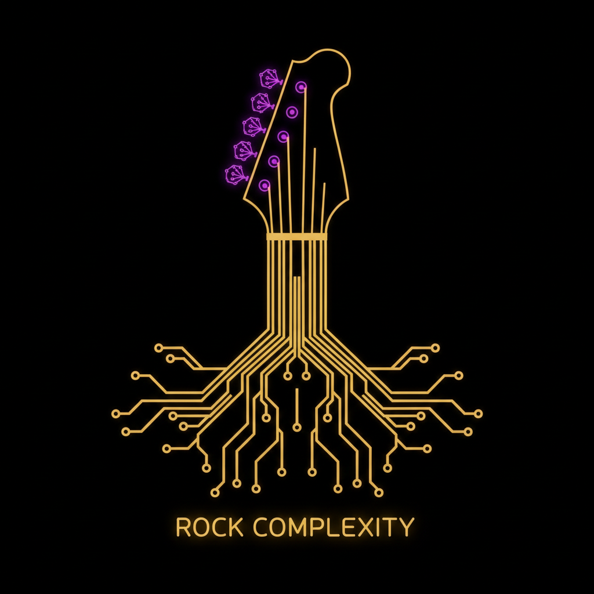

# Emergent Games — Band & Music Collection

Twenty one-prompt emergent music band games for your favorite chatbot. Each game uses the same engine: autonomous agents, system meters, causal feedback loops, and emergent storytelling. No scripted narratives — everything arises from the system state.

Egos, riffs, and breakdowns. Creative passion meets industry machine. The garage, the label, the tour, the comeback. Rock, pop, indie, rap — different genres, same human drama behind the music.

## The Games

| # | Name | Scenario | The Pressure |
|---|------|----------|-------------|
| 01 | The Garage | Forming a band from scratch, first gig | Chemistry + identity |
| 02 | The Label | Record deal offered — but the terms | Freedom + money |
| 03 | The Tour | 30 cities, one bus, egos escalating | Exhaustion + proximity |
| 04 | The Album | Creative differences during recording | Art + compromise |
| 05 | The Rivalry | Two bands from same scene competing | Pride + community |
| 06 | The Comeback | Broken-up band tries reunion | History + hope |
| 07 | The One Hit | You had one hit — everyone expects another | Expectation + identity |
| 08 | The Producer | Working with a genius tyrant | Brilliance + control |
| 09 | The Addiction | Bandmate spiraling, band depends on them | Loyalty + survival |
| 10 | The Festival | Your big break — one set to prove yourselves | Pressure + opportunity |
| 11 | The Solo Album | Going solo without destroying the band | Ambition + loyalty |
| 12 | The Manager | Industry shark or guardian angel? | Trust + business |
| 13 | The Leak | Album leaked before release | Damage + adaptation |
| 14 | The Scandal | Lead singer in PR disaster | Image + truth |
| 15 | The Evolution | Fans want old sound, you want to grow | Art + audience |
| 16 | The Collab | Forced collaboration with artist you hate | Ego + professionalism |
| 17 | The Viral Moment | TikTok made you famous — now what? | Authenticity + opportunity |
| 18 | The Break | Indefinite hiatus — is it the end? | Distance + doubt |
| 19 | The Legacy | Legendary band, one last album | Perfection + mortality |
| 20 | The Indie | Refuse to sign, build it yourself | Integrity + poverty |
