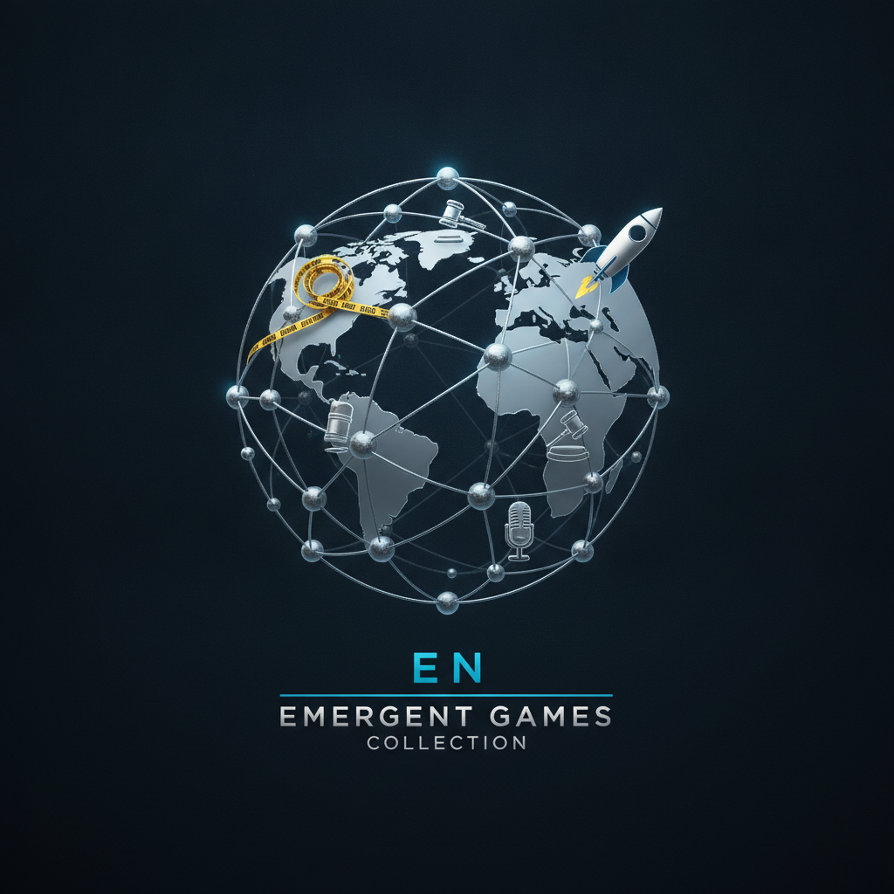

# Emergent Games — English Collection

Twenty one-prompt emergent games for your favorite chatbot. Each game uses the same engine: autonomous agents, system meters, causal feedback loops, and emergent storytelling. No scripted narratives — everything arises from the system state.

## The Games

| # | Name | Genre | You play as |
|---|------|-------|-------------|
| 01 | The Heist | Crime / Thriller | Mastermind planning a museum heist |
| 02 | Orbital Station | Hard SF / Management | Commander of aging space station |
| 03 | The Cult Deprogrammer | Psychology / Thriller | Therapist extracting someone from a cult |
| 04 | Pirate Republic | Historical / Political | Governor of Nassau, 1715 |
| 05 | Deep State | Conspiracy / Political thriller | Intelligence director navigating shadows |
| 06 | The Ark | Climate / Survival | Captain of last climate refuge ship |
| 07 | Startup Deathmatch | Business / Competition | Founder in a winner-take-all market |
| 08 | The Plague Doctor | Historical / Medical | Physician during the Black Death |
| 09 | Reality TV | Media / Social psychology | Producer of a live reality show |
| 10 | The Warden | Ethics / Prison | Warden of a maximum-security prison |
| 11 | Lingua Franca | Linguistics / Diplomacy | Translator at impossible negotiations |
| 12 | The Orchestra | Art / Leadership | Conductor of a world-class orchestra in crisis |
| 13 | Rogue Nation | Geopolitics / Strategy | Leader of a small nation between superpowers |
| 14 | The Inheritance | Legal / Family drama | Estate lawyer with impossible will |
| 15 | Underground Railroad | Historical / Moral | Conductor on the Underground Railroad, 1850 |
| 16 | The Simulation | Metaphysics / SF | Scientist who discovers reality is simulated |
| 17 | Famine | Humanitarian / Ethics | Aid director during a famine |
| 18 | The Haunted House | Horror / Psychology | Paranormal investigator (rational explanations exist) |
| 19 | Revolution | Political philosophy | Revolutionary who must now govern |
| 20 | The Last Library | Post-apocalyptic / Knowledge | Librarian preserving knowledge after collapse |
