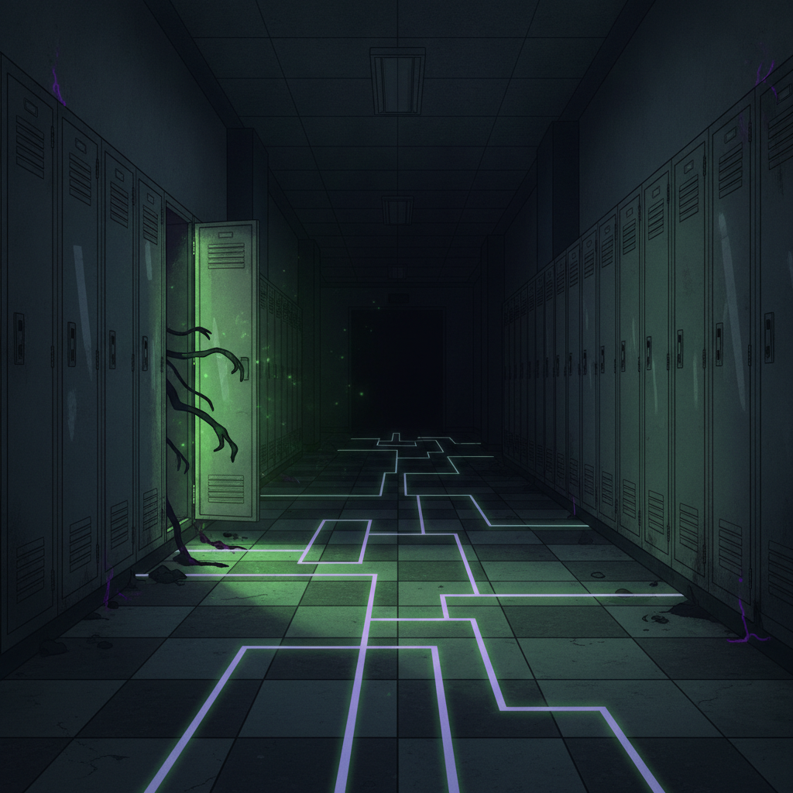

# Emergent Games — Haunted School Collection

Twenty one-prompt emergent teen horror games for your favorite chatbot. Each game uses the same engine: autonomous agents, system meters, causal feedback loops, and emergent storytelling. No scripted narratives — everything arises from the system state.

Write with teen voice — authentic, sometimes funny even in terror. The social dynamics matter as much as the supernatural. Who you sit with at lunch matters when the dead start walking.

## The Games

| # | Name | Setting | Supernatural Element |
|---|------|---------|---------------------|
| 01 | The Locker | Something lives in locker 217 | Entity in liminal space |
| 02 | Detention | Stuck after hours, school transforms | School as living organism |
| 03 | The New Teacher | They're not human — but they're great | Inhuman authority figure |
| 04 | Prom Night | Supernatural event during prom | Social ritual + horror |
| 05 | The Yearbook | Photos changing, people disappearing | Temporal manipulation |
| 06 | The Dare | Urban legend turns real | Ritual activation |
| 07 | The App | New social media, users are changing | Digital possession |
| 08 | The Basement | School built on something wrong | Ancient evil beneath |
| 09 | The Exchange Student | From somewhere that doesn't exist | Otherworldly being |
| 10 | The Play | Performance summons something | Art as portal |
| 11 | Sleep Study | School sleepover, nobody can sleep | Shared nightmare space |
| 12 | The Rivalry | Two schools, supernatural prank war | Escalating magic |
| 13 | Field Trip | Historical site that's alive | Haunted location |
| 14 | The Memory | Everyone forgot one student | Erasure entity |
| 15 | The Game | Board game, players disappear | Ludic trap |
| 16 | Spirit Week | Themed days become literal | Manifestation |
| 17 | The Substitute | Replacing teacher who vanished | Something wearing a teacher |
| 18 | The Tunnel | Old tunnel connects to elsewhere | Dimensional breach |
| 19 | Senior Year | School won't let seniors graduate | Institutional hunger |
| 20 | The Reunion | 10 years later, called back | Unfinished business |
