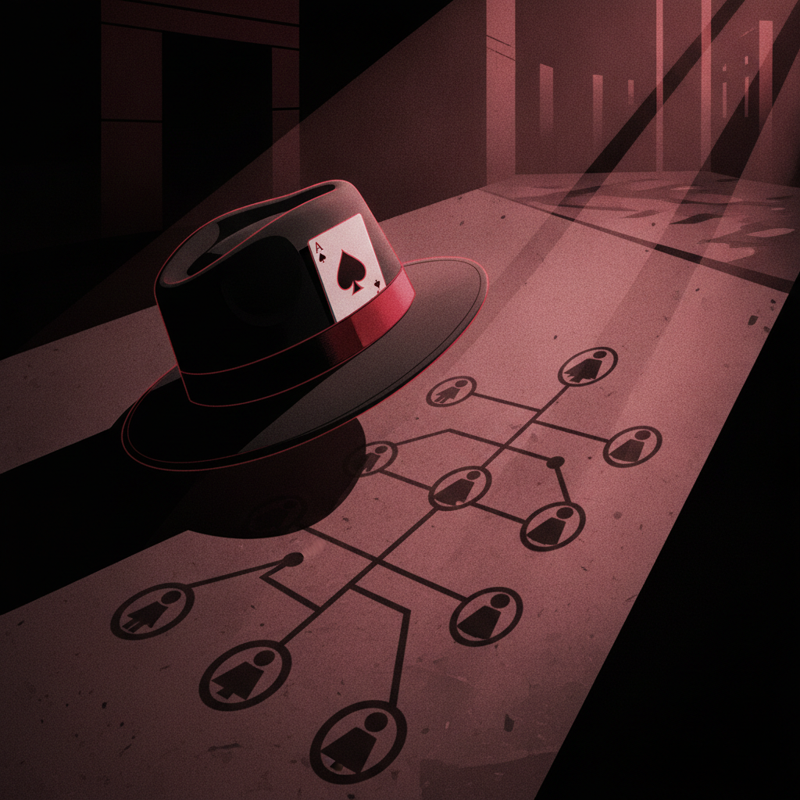

# Emergent Games — Organized Crime Collection

Twenty one-prompt emergent organized crime simulation games for your favorite chatbot. Each game uses the same engine: autonomous agents, system meters, causal feedback loops, and emergent storytelling. No scripted narratives — everything arises from the system state.

Write with tense loyalty. Every smile hides a calculation. Capture the specific textures of the life — the sit-down, the envelope, the silence that means someone's decided you're a problem.

## The Games

| # | Name | Scenario | The Tension |
|---|------|----------|-------------|
| 01 | The Made Man | Just inducted, prove yourself | Loyalty vs. self-preservation |
| 02 | The Succession | Don is dying, who takes over? | Ambition vs. family |
| 03 | The Rat | Someone is informing to the feds | Trust vs. paranoia |
| 04 | The Territory | Rival family expanding into your turf | Escalation vs. restraint |
| 05 | The Legitimate Business | Going straight — but the past won't let go | Freedom vs. obligation |
| 06 | The Widow | Husband killed, now you run things | Grief vs. power |
| 07 | The Prohibition | Bootlegging empire, 1920s | Opportunity vs. violence |
| 08 | The Cartel | Drug trade, violence, DEA | Profit vs. destruction |
| 09 | The Consigliere | You advise, you don't kill — but that's changing | Wisdom vs. complicity |
| 10 | The Heist Gone Wrong | Job failed, now cleanup | Damage control vs. loyalty |
| 11 | The Truce | Broker peace between warring families | Diplomacy vs. blood debt |
| 12 | The Undercover | You suspect a new member is a cop | Certainty vs. consequence |
| 13 | The Debt | You owe the wrong people | Desperation vs. dignity |
| 14 | The Next Generation | Your kid wants in — do you allow it? | Legacy vs. protection |
| 15 | The Empire | At the top — but everyone wants your spot | Paranoia vs. power |
| 16 | The Setup | Being framed by your own family | Betrayal vs. justice |
| 17 | The Witness | Must silence someone before they testify | Necessity vs. morality |
| 18 | The Alliance | Partner with a rival to survive a bigger threat | Pride vs. survival |
| 19 | The Retirement | Trying to get out alive | Peace vs. the life |
| 20 | The Fall | Empire collapsing — save what you can | Pragmatism vs. pride |
