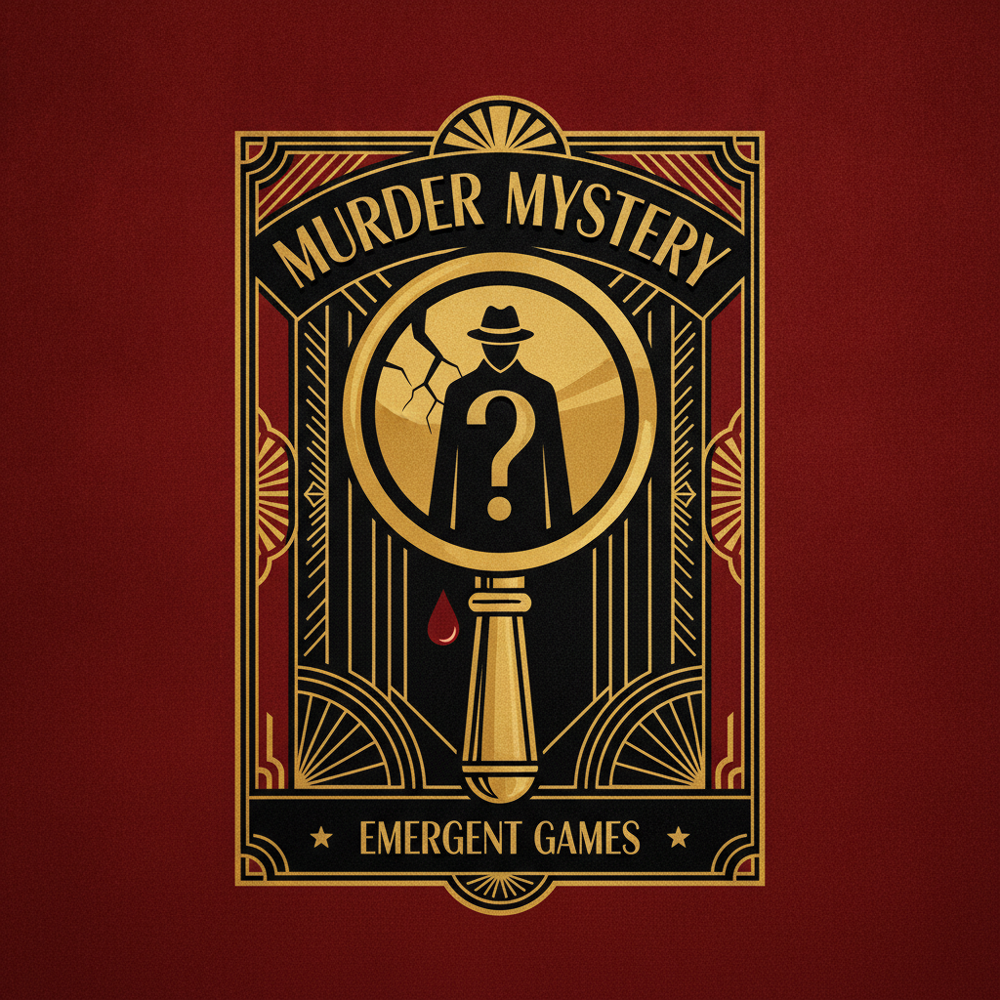

# Emergent Games — Murder Mystery Edition

Twenty Agatha Christie-style murder mysteries. In each game, a murder has been committed. You must find the killer before they find you. The AI generates a fixed hidden truth at the start — the solution exists from Turn 1. Your job: gather evidence, question suspects, and survive long enough to solve it.

**Win condition:** Correctly accuse the murderer with supporting evidence.  
**Lose condition:** You become the next victim, or you accuse the wrong person (allowing the real killer to escape — or strike again).

| # | Name | Setting | Victim |
|---|------|---------|--------|
| 01 | Death at the Manor | English country house weekend | The host |
| 02 | Murder on the Orient Express... Bus | Long-distance night bus stuck in snow | The driver |
| 03 | The Poisoned Chalice | Wine tasting at a Tuscan villa | Renowned sommelier |
| 04 | Curtain Call | West End theatre, opening night | Lead actress |
| 05 | The Locked Laboratory | University research lab | Professor found dead |
| 06 | Death on the Nile... Cruise | Mediterranean cruise ship | The ship's doctor |
| 07 | The Wedding Slaughter | Destination wedding on Greek island | The bride's father |
| 08 | Murder at the Monastery | Isolated mountain monastery | The abbot |
| 09 | The Auction House | Sotheby's-style auction of stolen art | The auctioneer |
| 10 | Death in First Class | Transatlantic flight | Billionaire in seat 1A |
| 11 | The Ski Lodge | Avalanche-isolated alpine lodge | Olympic ski coach |
| 12 | Murder at the Reunion | University 25-year reunion | The most successful classmate |
| 13 | The Lighthouse Keeper | Remote lighthouse, storm incoming | The previous keeper (found dead) |
| 14 | Death at the Embassy | Diplomatic reception | Ambassador |
| 15 | The Bookshop Mystery | Antiquarian bookshop, rare manuscript | The owner |
| 16 | Murder on the Express | Night train, Paris to Istanbul | Journalist in sleeper car |
| 17 | The Island Retreat | Wellness retreat on private island | Celebrity wellness guru |
| 18 | Death in the Kitchen | Michelin-star restaurant, after hours | Head chef |
| 19 | The Art Colony | Remote artists' community | Controversial painter |
| 20 | Murder at the Will Reading | Lawyer's office, family gathered | The family patriarch (drops dead at reading) |
