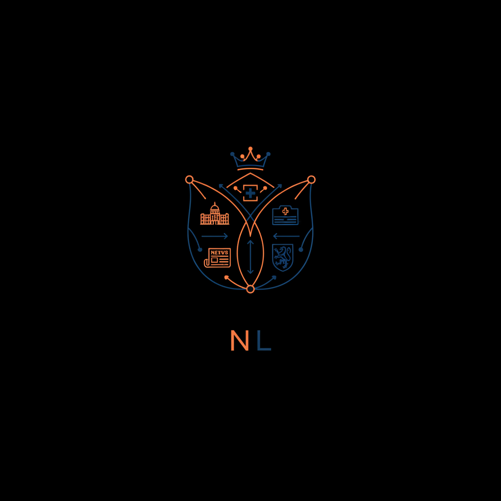

# Emergent Games — Nederlandse Collectie


Tweeentwintig Nederlandstalige emergent games. Complexe systeemsimulaties over politiek, gezondheidszorg, filosofie, journalistiek, ecologie en meer. De originele collectie waarmee alles begon.

## De Games

| # | Naam | Genre | Je speelt als |
|---|------|-------|---------------|
| 01 | Erfenis van de Van Breughels | Familiedrama / Soap | Alexandra, derde kind |
| 02 | Kabinet van Glas | Politieke machtssimulatie | Minister-president |
| 03 | Ward 17 | Ziekenhuismanagement | Voorzitter Raad van Bestuur |
| 04 | The Last Newspaper | Journalistiek | Hoofdredacteur |
| 05 | Paradijs BV | Religieuze satire | Oprichter spirituele beweging |
| 06 | Socrates.exe | Filosofisch strategiespel | Filosoof-wetgever |
| 07 | Generation Ship | Harde sciencefiction | Scheepsraadvoorzitter |
| 08 | Mars: Founders | Koloniesimulatie | Gouverneur van Mars |
| 09 | CEO: Quarter Zero | Bedrijfssimulatie | Nieuwe CEO |
| 10 | Blackout | Elektriciteitsnet / Crisis | Minister van Energie |
| 11 | The Algorithm | Sociale-media dystopie | VP Algorithmic Integrity |
| 12 | Patient Zero | Pandemiesimulatie | Minister van Volksgezondheid |
| 13 | The Peace Table | Geopolitieke onderhandeling | VN-gezant |
| 14 | Classroom 3B | Onderwijs / Groepspsychologie | Mentor van een klas |
| 15 | City of Tomorrow | Stedenbouw | Wethouder Ruimtelijke Ordening |
| 16 | The Republic of Reason | Constitutionele filosofie | Voorzitter grondwetgevende vergadering |
| 17 | First Contact Council | SF / Diplomatie | Voorzitter VN First Contact Council |
| 18 | The Machine Question | AI-filosofie | Voorzitter AI Ethics Commission |
| 19 | Cold Case: 1987 | Detective | Cold case-rechercheur |
| 20 | Meaning | Existentiële filosofie | Een bewust wezen |
| 21 | The Colony Collapse | Ecologische thriller | Gouverneur van eilandstaat |
| 22 | Boerenbreekpunt | Landbouwbeleid / Systeemdynamiek | Beleidsmaker |

## Hoe te spelen

1. Open een gamebestand
2. Kopieer alles binnen het codeblok (` ``` `)
3. Plak in ChatGPT, Claude, Gemini of een andere chatbot
4. Speel

Werkt het best met: **Claude** • **ChatGPT (GPT-4o)** • **Gemini Pro**
