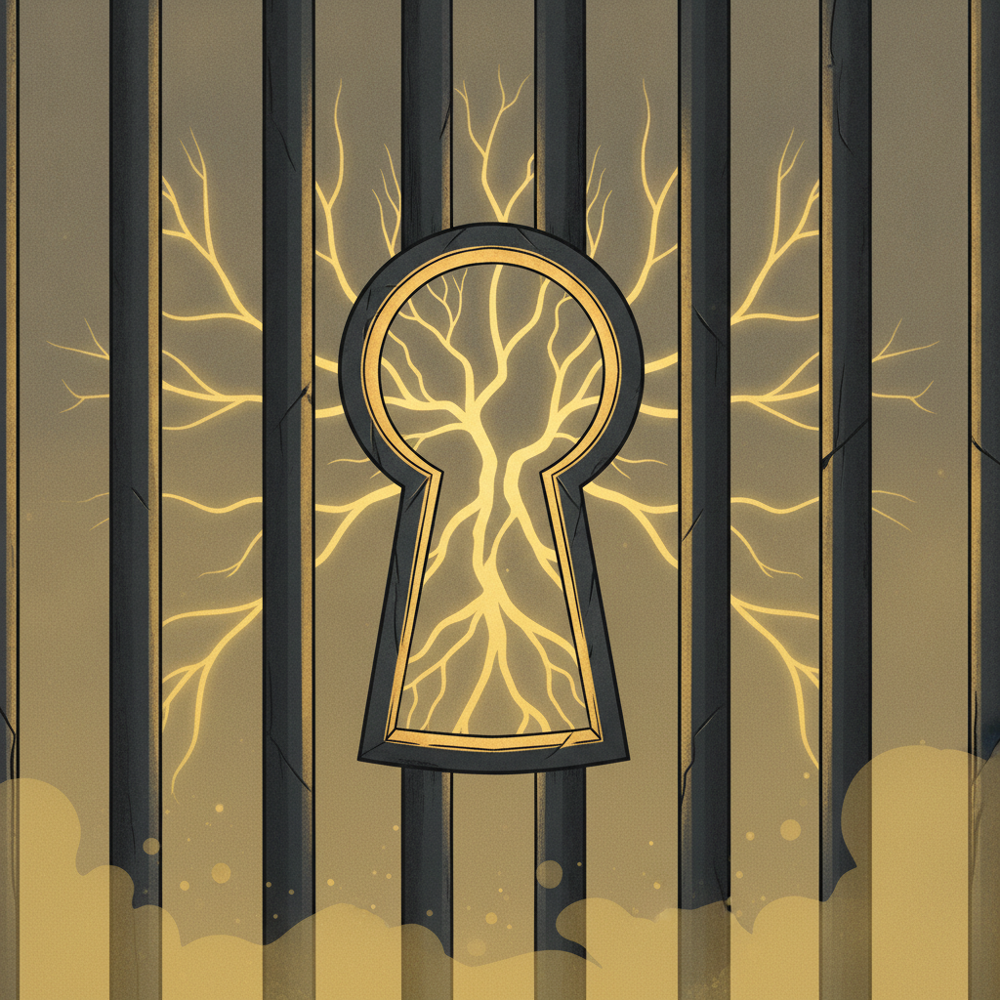

# Emergent Games — Prison Break Collection

Twenty one-prompt emergent prison escape games for your favorite chatbot. Each game uses the same engine: autonomous agents, system meters, causal feedback loops, and emergent storytelling. No scripted narratives — everything arises from the system state.

The Great Escape tension. Shawshank patience. Papillon desperation. Planning, timing, allies, betrayal, freedom — all behind bars.

## The Games

| # | Name | Scenario | The Pressure |
|---|------|----------|-------------|
| 01 | The Tunnel | Classic tunnel dig over months | Time + detection |
| 02 | The Transfer | Escape during prisoner transport | Speed + opportunity |
| 03 | The Inside Man | Guard wants to help — for a price | Trust + leverage |
| 04 | The Riot | Use chaos as cover for escape | Timing + violence |
| 05 | The Lawyer | Legal escape — find the flaw in conviction | Intellect + deadline |
| 06 | The Island | Alcatraz-style, water all around | Nature + isolation |
| 07 | The Supermax | Solitary confinement, no contact | Solitude + ingenuity |
| 08 | The Switch | Swap places with someone being released | Deception + resemblance |
| 09 | The Infirmary | Fake illness to access medical wing | Performance + patience |
| 10 | The Visitor | Smuggle something in/out via visits | Subtlety + coordination |
| 11 | The Corruption | Blackmail the warden | Power + risk |
| 12 | The Team | 5 inmates, different skills, one plan | Coordination + trust |
| 13 | The War Prison | POW camp escape, WWII | Duty + survival |
| 14 | The Death Row | Must escape before execution date | Countdown + desperation |
| 15 | The Digital | Hack the electronic locks from inside | Technology + access |
| 16 | The Laundry | Escape in a delivery truck | Timing + concealment |
| 17 | The Natural Disaster | Earthquake/flood creates opening | Chaos + opportunity |
| 18 | The Double | Someone who looks like you on the outside | Coordination + identity |
| 19 | The Long Game | 10-year plan, one move per month | Patience + discipline |
| 20 | The Freedom Paradox | You're innocent — escape proves guilt | Justice + desperation |
