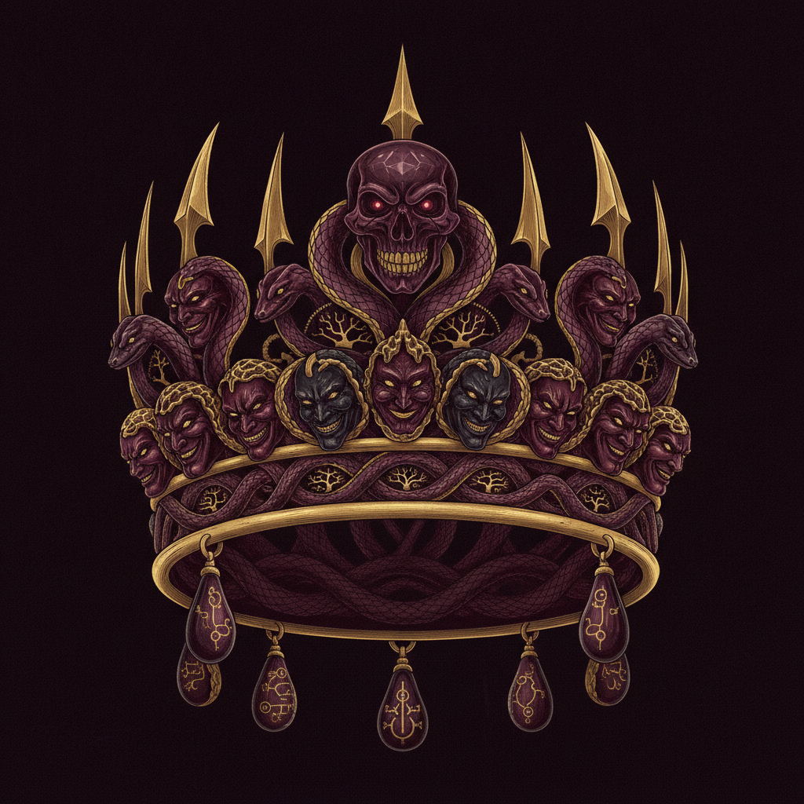

# Emergent Games — Royal Court Collection

Twenty one-prompt emergent royal court simulation games for your favorite chatbot. Each game uses the same engine: autonomous agents, system meters, causal feedback loops, and emergent storytelling. No scripted narratives — everything arises from the system state.

Write with elegant menace. Wit and danger beneath every courtesy. Capture the specific textures of period court life — the whispered aside, the poisoned compliment, the smile that conceals a blade.

## The Games

| # | Name | Scenario | The Tension |
|---|------|----------|-------------|
| 01 | The Debutante | Marriage season, find a match | Innocence vs. ruthless market |
| 02 | The Succession | King dying, you're not the favored heir | Ambition vs. survival |
| 03 | The Mistress | Royal favorite, power through the bedchamber | Desire vs. political survival |
| 04 | The Spymaster | Court intrigue, everyone has secrets | Knowledge vs. trust |
| 05 | The Foreign Bride | Married into a hostile court | Isolation vs. influence |
| 06 | The Regent | Ruling for a child king, nobles circling | Authority vs. legitimacy |
| 07 | The Scandal | A letter exists that could ruin you | Containment vs. exposure |
| 08 | The Tournament | Knights, honor, and political maneuvering | Glory vs. conspiracy |
| 09 | The Alliance | Arrange a marriage that prevents war | Duty vs. humanity |
| 10 | The Bastard | Illegitimate but ambitious | Merit vs. blood |
| 11 | The Dowager | Aging queen protecting her legacy | Relevance vs. graceful exit |
| 12 | The Coronation | The week before you're crowned | Preparation vs. sabotage |
| 13 | The Poisoner | Someone is killing courtiers | Justice vs. paranoia |
| 14 | The Rebellion | Nobles threaten revolt | Compromise vs. force |
| 15 | The Portrait | Marriage arranged by portrait alone | Expectation vs. reality |
| 16 | The Lady-in-Waiting | Serving the queen, loving the king | Loyalty vs. desire |
| 17 | The Duel | Honor demands blood | Principle vs. consequence |
| 18 | The Heir Problem | Produce an heir or lose everything | Biology vs. politics |
| 19 | The Exiled Prince | Returned to claim your throne | Right vs. might |
| 20 | The Last Dynasty | Your house is falling — save it or fall with dignity | Pride vs. pragmatism |
