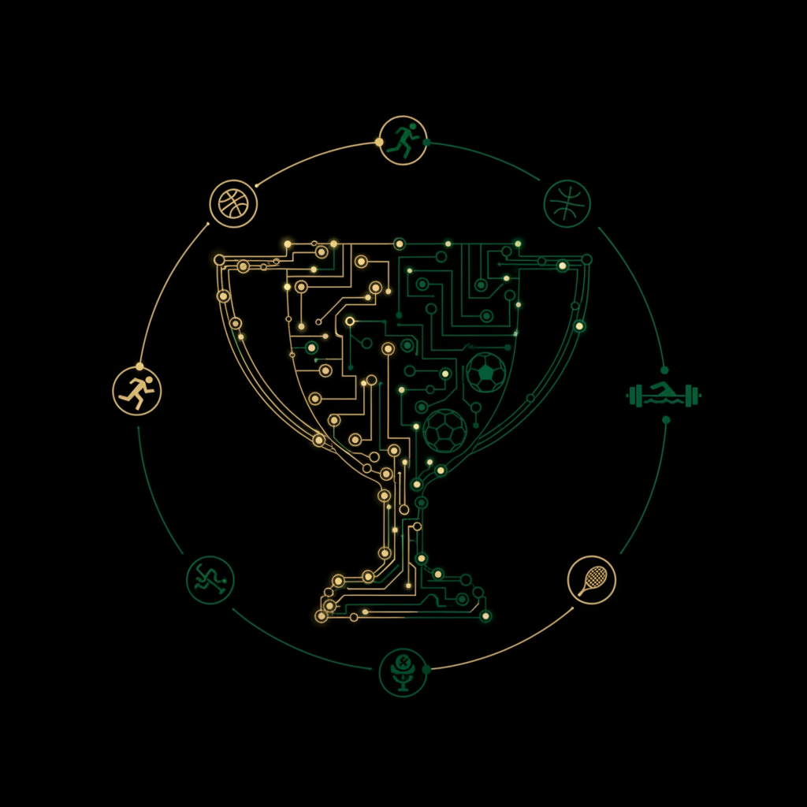

# Emergent Games — Sports Dynasty Collection

Twenty one-prompt emergent sports management games for your favorite chatbot. Each game uses the same engine: autonomous agents, system meters, causal feedback loops, and emergent storytelling. No scripted narratives — everything arises from the system state.

Coach, manage, and build. Player development, ego management, media pressure, injuries, transfers, rivalries. Different sports, different levels, same human drama underneath.

## The Games

| # | Name | Sport | You play as |
|---|------|-------|-------------|
| 01 | Premier League | Football (Soccer) | Manager of newly promoted club |
| 02 | NBA Rebuild | Basketball | GM of tanking/rebuilding franchise |
| 03 | Olympic Coach | Multi-sport | National team head coach |
| 04 | College Football | American Football | Head coach navigating NCAA |
| 05 | F1 Team Principal | Formula 1 | Team principal with two drivers |
| 06 | Boxing Trainer | Boxing | Trainer with aging champion |
| 07 | Esports | Competitive Gaming | Manager of pro esports team |
| 08 | National Cricket | Cricket | Coach building non-traditional nation |
| 09 | Women's Soccer | Football (Soccer) | Coach fighting for equality AND wins |
| 10 | Tennis Academy | Tennis | Academy director developing talent |
| 11 | Rugby World Cup | Rugby Union | Head coach with 6 months to peak |
| 12 | Minor League Baseball | Baseball | Manager developing players while winning |
| 13 | Tour de France | Cycling | Team director during the Tour |
| 14 | MMA Gym | Mixed Martial Arts | Head coach managing fighters |
| 15 | Paralympic Team | Paralympic Sports | Head coach proving excellence |
| 16 | Youth Academy | Youth Development | Academy director developing ethically |
| 17 | Expansion Team | Multi-sport | GM building franchise from nothing |
| 18 | Relegation Battle | Football (Soccer) | Manager in survival fight |
| 19 | The Transfer Window | Football (Soccer) | Sporting director, 48 hours |
| 20 | Dynasty in Decline | Multi-sport | Legendary coach's last season |
