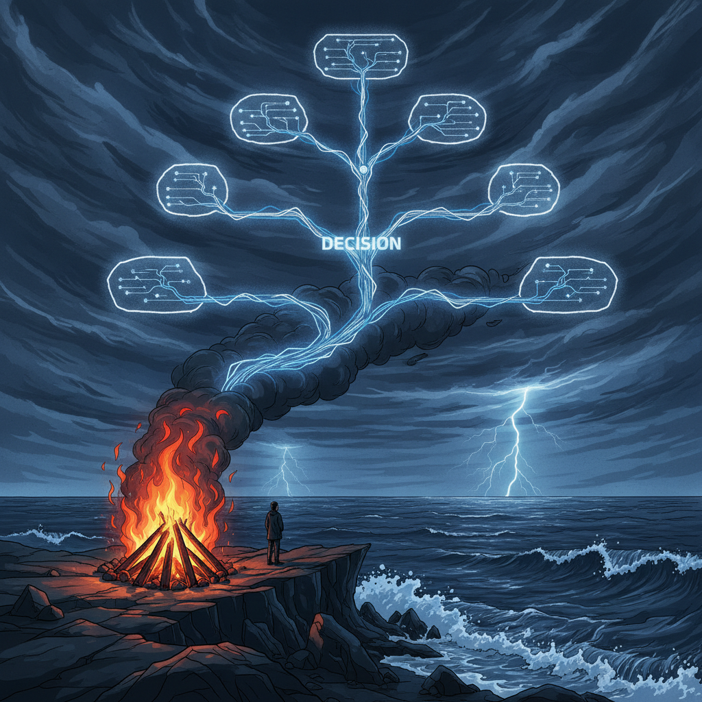

# Emergent Games — Survival Island Collection

Twenty one-prompt emergent survival games for your favorite chatbot. Each game uses the same engine: autonomous agents, system meters, causal feedback loops, and emergent storytelling. No scripted narratives — everything arises from the system state.

## The Games

| # | Name | Setting | Unique Pressure |
|---|------|---------|-----------------|
| 01 | The Crash | Plane crash, tropical island, 15 survivors | Initial chaos + injury triage |
| 02 | The Raft | Adrift at sea, 8 people, one raft | Space, water, exposure, sharks |
| 03 | The Mountain | Hikers stranded above treeline, storm coming | Altitude + weather vs. descent |
| 04 | The Desert | Bus breakdown in Sahara, 12 passengers | Heat, water, distance |
| 05 | The Bunker | Nuclear shelter, 20 people, supplies for 10 | Math of scarcity |
| 06 | The Arctic | Research station, winter, radio dead | Cold, darkness, isolation madness |
| 07 | The Cave | Trapped underground, water rising | Claustrophobia + time pressure |
| 08 | The Lifeboat | Sinking ship, too many people, not enough boats | Immediate impossible choices |
| 09 | The Reality Show | Survivor-style but actually stranded | Nobody believes it's real |
| 10 | The Jungle | Amazon, indigenous territory, tourists | Environment as adversary |
| 11 | The Space Station | Stranded in orbit, oxygen running out | No rescue, physics constraints |
| 12 | The Flood | Rooftop survivors, water rising, days until rescue | Vertical survival, shrinking space |
| 13 | The Volcano | Island, eruption imminent, one boat | Evacuation math + geology |
| 14 | The Blizzard | Ski lodge, snowed in, generator failing | Comfort → crisis transition |
| 15 | The Saboteur | Someone doesn't want rescue | Enemy within |
| 16 | The Children | Only adult with 12 kids | Total responsibility |
| 17 | The Rivalry | Two groups, one rescue spot | Competition for salvation |
| 18 | The Signal | Rescue signal means splitting the group | Together vs. possible rescue |
| 19 | The Countdown | Rescue in 7 days confirmed | Known endpoint, unknown survival |
| 20 | Lord of the Flies | Society rebuilding goes dark | Human nature unmasked |
