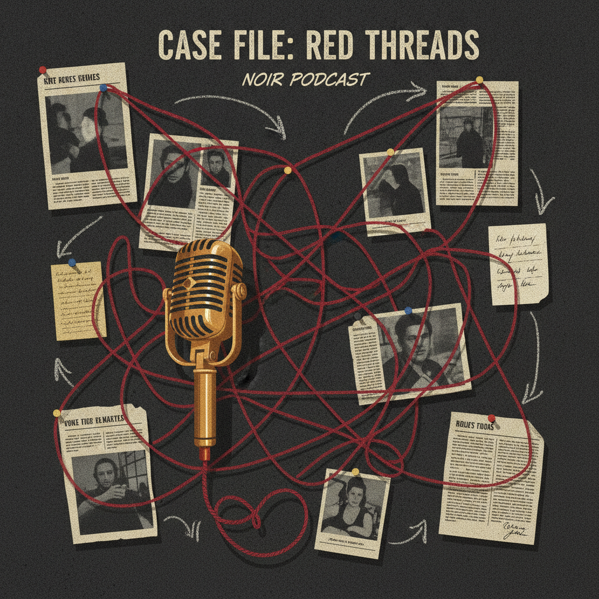

# Emergent Games — True Crime Podcast Collection

Twenty one-prompt emergent true crime investigation games for your favorite chatbot. Each game uses the same engine: autonomous agents, system meters, causal feedback loops, and emergent storytelling. No scripted narratives — everything arises from the system state.

You run a podcast investigating cases. Interview witnesses, find evidence, manage your audience, face legal threats, and maybe put yourself in danger. The truth isn't always safe to find.

## The Games

| # | Name | Case Type | The Danger |
|---|------|-----------|-----------|
| 01 | The Cold Case | 20-year-old murder | Town still divided |
| 02 | The Disappearance | Missing college student | Police gave up |
| 03 | The Serial | Connected murders | Crossing state lines |
| 04 | The Wrongful Conviction | Innocent in prison | System fights back |
| 05 | The Missing Children | Three kids, same school | Pattern across years |
| 06 | The Whistleblower | Corporate manslaughter | Source is terrified |
| 07 | The Cult | Deaths ruled suicide | Families disagree |
| 08 | The Accident | Insurance fraud? | Powerful people involved |
| 09 | The Celebrity | Famous death, ruled natural | Fans find anomalies |
| 10 | The Cop | Detective was the killer? | Investigating the investigators |
| 11 | The Confession | False confession? | Story doesn't add up |
| 12 | The Pattern | Connected cold cases | Decades-old thread |
| 13 | The Witness | Key witness wants to recant | Live on your podcast |
| 14 | The Family | Victim's family says stop | Investigating against wishes |
| 15 | The Threat | Someone wants this buried | Making it clear |
| 16 | The Partner | Co-host has undisclosed connection | Trust broken |
| 17 | The Evidence | Found what police missed | Air it or hand it over? |
| 18 | The Copycat | Podcast inspired a copycat | Your responsibility? |
| 19 | The Resolution | Know who did it, can't prove it | Legal vs. moral justice |
| 20 | Live Episode | Recording live, suspect present | Maximum danger |
