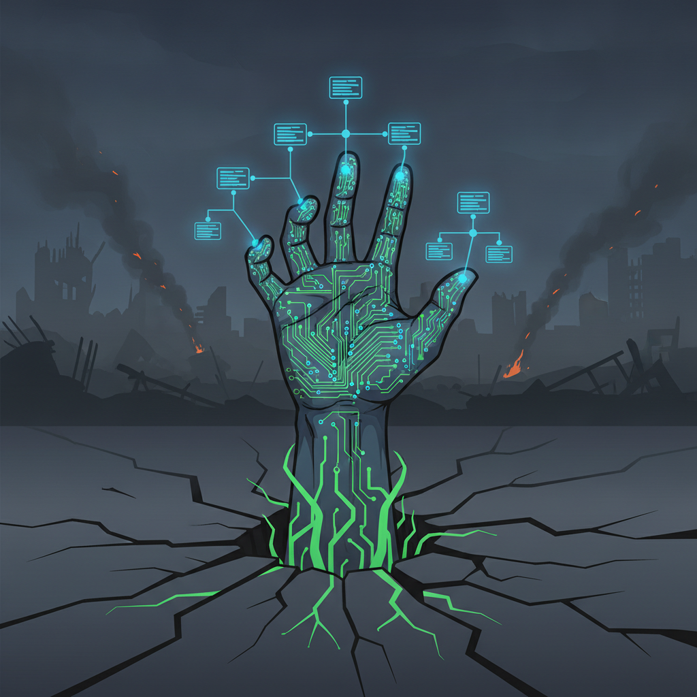

# Emergent Games — Zombie Apocalypse Collection

Twenty one-prompt emergent zombie survival games for your favorite chatbot. Each game uses the same engine: autonomous agents, system meters, causal feedback loops, and emergent storytelling. No scripted narratives — everything arises from the system state.

## The Games

| # | Name | Setting | Unique Threat |
|---|------|---------|---------------|
| 01 | Shopping Mall | Dawn-of-the-dead style mall, 20 survivors | Horde pressure + dwindling supplies |
| 02 | The Hospital | Medical facility, infected patients | Infection from within |
| 03 | School Bus | Kids + 2 adults, on the road | Mobility vs. vulnerability of children |
| 04 | Military Base | Chain of command vs. survival instinct | Authority collapse under pressure |
| 05 | Cruise Ship | Luxury liner, 500 passengers | Containment on open water |
| 06 | The Prison | Inmates + guards, fortified walls | Walls trap you in too |
| 07 | Small Town | Everyone knows everyone, some are turning | Trust erosion in tight community |
| 08 | Subway System | Underground network, dark, connected | Can't see what's coming |
| 09 | Research Lab | Possible cure, high security | Knowledge vs. containment risk |
| 10 | The Farm | Isolated, defensible, food source | Complacency and isolation |
| 11 | Skyscraper | Vertical survival, floor by floor | Trapped above, horde below |
| 12 | The Airport | Planes exist, fuel is limited | Escape temptation vs. group safety |
| 13 | The Island | Paradise until someone gets bitten | Nowhere to run |
| 14 | Winter | Cold slows zombies but kills survivors | Environment as double-edged weapon |
| 15 | Year Two | Society rebuilding, politics emerging | Human threats surpass zombie threats |
| 16 | Children's Hospital | Protecting kids who can't protect themselves | Moral weight of every decision |
| 17 | The Caravan | Moving group, nomadic survival | No permanent safety |
| 18 | Radio Station | Last voice on air, people coming to you | Beacon attracts all — living and dead |
| 19 | The Cure | You carry it, everyone wants you | Being the target |
| 20 | Intelligent Zombies | They're learning, adapting, organizing | Enemy that evolves |
