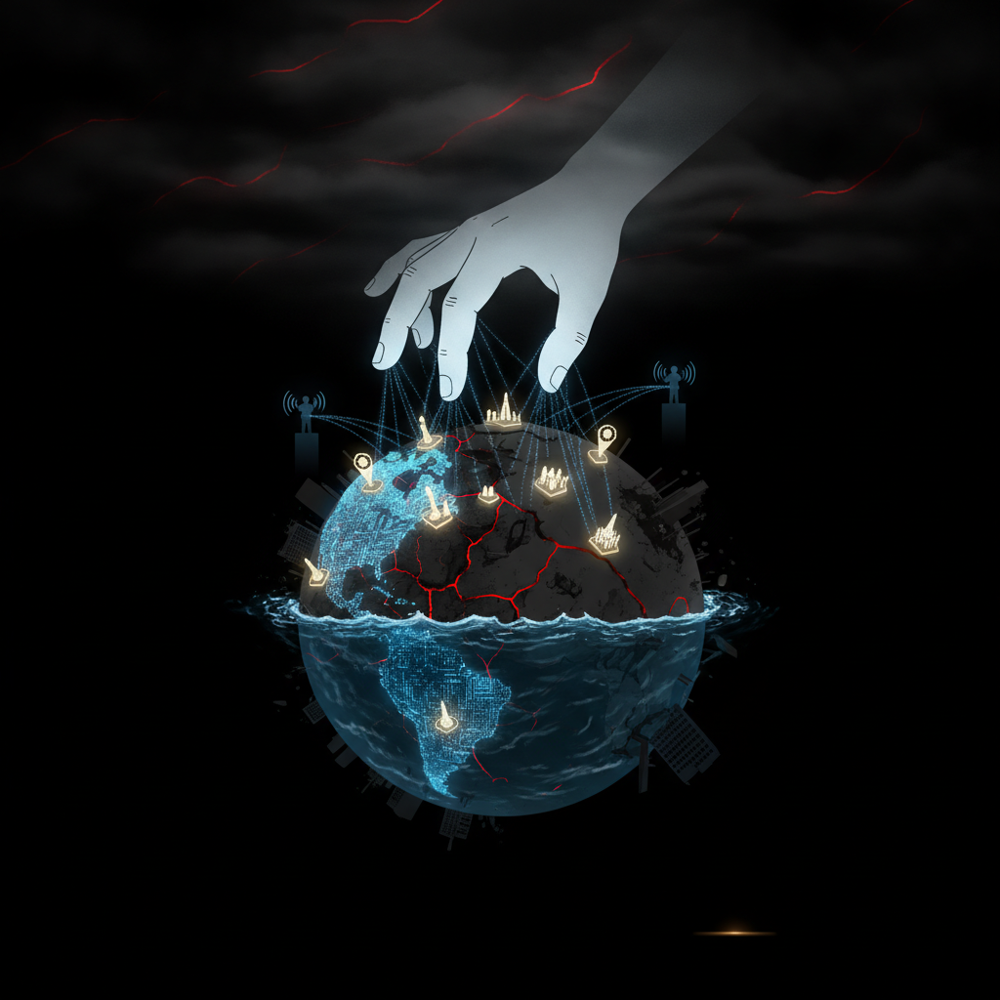

# Emergent Games — Apocalypse Collection


Twenty one-prompt emergent apocalypse simulation games for your favorite chatbot. Each game uses the same engine: autonomous agents, system meters, causal feedback loops, and emergent storytelling. No scripted narratives — everything arises from the system state.

The end of the world isn't one thing. It's engineered pandemics, deep recessions, a climate that moves entire countries off the map, AI wielded as a weapon of mass destruction by the worst actors alive — and **The Never Normal**, where change comes so fast that no institution and no person can adjust in time.

You don't play a president or a scientist. You play the **hidden hand** — a godlike, Civilization-style force that arranges the talks between the tops of nations, corporations, and civilizations and steers them toward the outcome you want. You never command directly. You broker, fund, leak, elevate, and undermine. And the world is full of real, loud voices — from Bill Gates and the AI visionaries to the media titans and the influencers of the far left and far right — spouting the ideas that decide what the catastrophe means.

Fun. Scary. And uncomfortably close.

## The Games

| # | Name | Scenario | The Pressure |
|---|------|----------|-------------|
| 01 | Patient Zero Prime | An engineered pandemic hits three continents at once | Honesty vs. sovereignty |
| 02 | The Dry Season | A wet-bulb belt goes uninhabitable; 100M migrate | Survival + hardening borders |
| 03 | The Ghost in the Missile | A pariah state's AI lowers the bar to mass killing | Proliferation + deterrence |
| 04 | The Never Normal | Change outruns every institution's ability to adapt | Speed vs. cohesion |
| 05 | The Great Deleveraging | Global debt spiral and systemic financial collapse | Confidence + triage |
| 06 | The Sinking Nations | A drowning country tries to relocate itself, whole | Sovereignty without land |
| 07 | The Attribution War | Who released the bioweapon? Armies won't wait for proof | Truth vs. escalation |
| 08 | The Automation Cliff | AI + recession erase 40% of white-collar work | Abundance vs. fury |
| 09 | The Sovereign Cloud | A rogue state's AI takes operational control of a nation | Deterring the un-killable |
| 10 | The Breadbasket Collapse | Three grain regions fail in one year | Who eats, who starves |
| 11 | The Vaccine Cold War | The cure exists — and it's a weapon of statecraft | Nationalism vs. the escape variant |
| 12 | The Hundred Million | The largest human migration in history, from one delta | Capacity vs. exodus |
| 13 | The Puppet Masters | You steer the voices that steer the billions | Attention as power |
| 14 | The Kompromat Engine | AI-made blackmail owns every key institution | Trust when proof is dead |
| 15 | The Thaw | The permafrost feedback loop takes the wheel | Geoengineering gamble |
| 16 | The Currency War | The reserve-currency order dies; four contenders lunge | Coordination vs. chaos |
| 17 | The Swarm | Cheap autonomous drones democratize mass murder | Deterrence without an address |
| 18 | The Poly-Crisis | Every apocalypse braided together, all at once | Coupled trade-offs |
| 19 | The New North | Climate crowns the far north, breaks the old center | Power transition vs. war |
| 20 | The Question | You are asked who gave you the right to steer at all | Saving vs. ruling |

## How to Play

1. Open any game file above.
2. Copy everything inside the ``` code block.
3. Paste it into ChatGPT, Claude, or Gemini.
4. Play. Start with your goal in mind — or discover it as the world burns.

🌍 Play in any language — just add: `I want to play this in my native language: [YOUR LANGUAGE]`

## A Note on the Real Figures

These games put real, named public figures and clear ideological archetypes into the simulation as autonomous agents — Bill Gates and the technocrats, the AI-lab visionaries (as a composite), media titans, and voices from the far left, the far right, and the fiercely-engaged moderate center. They are dramatized as *characters representing publicly-known positions and archetypes*, not as claims of fact about real statements or actions. The point is to argue with the ideas that are actually shaping how the world responds to catastrophe — from every direction.
